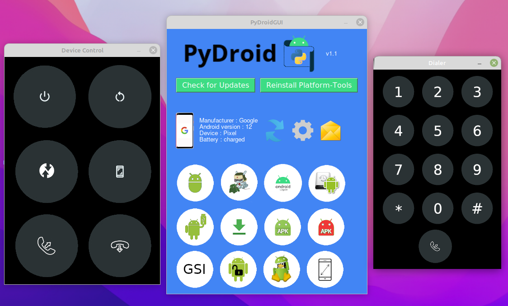

  <br/>
PyDroidGUI is an Android Platform-tools GUI that provides an easy-to-use user interface to control your Android Device

 

<br/>

# Screenshots

<br/>

# System Requirements
• <a href="https://www.python.org/downloads/">Python 3.10 version or newer</a><br/>
• Android KitKat or newer<br/>
• wget (Linux only)
<br/>

# Status
Just a demostration to show how PyDroid would look like with an user interface.</br>
Most of the functionalities from PyDroid aren't implemented yet
<br/>

# Installation

1. Enable developer options and USB debugging on your device, also enable Root debugging if available
<br/>(To enable it search online how to enable USB debugging on your device model)

2. Download the script source
<br/>To get started, paste the following command into your Windows or Linux cmd

```GNU/Linux ```
```
git clone https://github.com/daviiid99/PyDroidGUI.git PyDroidGUI
cd PyDroidGUI
python3 PyDroidGUI.py
```
<br/>

``` Microsoft Windows```
```
git clone https://github.com/daviiid99/PyDroidGUI.git PyDroidGUI
cd PyDroidGUI
python PyDroidGUI.py
```

<b>Optional</b><br/>
For Windows users, a .exe executable file is provided
<br/>Check <a href="https://github.com/daviiid99/PyDroidGUI/releases">Releases</a> for the latest binary
