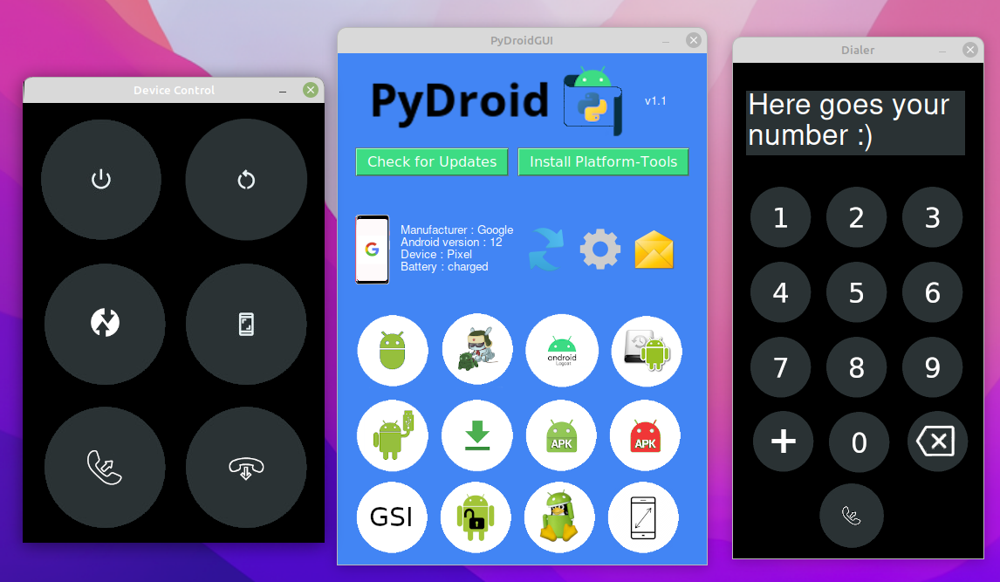

  <br/>
PyDroidGUI is an Android Platform-tools GUI that provides an easy-to-use user interface to control your Android Device

 

<br/>

# Screenshots

<br/>

# System Requirements
• <a href="https://www.python.org/downloads/">Python 3.10 version or newer</a><br/>
• Android KitKat (SDK 19) or newer (Recommended)<br/>
• wget (we're not using the python wget module for compatibility issues)

on Ubuntu/Debian you can install it with
```
sudo apt-get install wget
```

On Windows, you can install <a href="https://sourceforge.net/projects/gnuwin32/files/wget/1.11.4-1/wget-1.11.4-1-setup.exe/download?use_mirror=excellmedia">wget for Windows</a>

<br/>

# Status
Just a demostration to show how PyDroid would look like with an user interface.</br>
Most of the functionalities from PyDroid aren't implemented yet
<br/>

# Installation

To get started, paste the following command into your Linux cmd
```
git clone https://github.com/daviiid99/PyDroidGUI.git PyDroidGUI
cd PyDroidGUI
python3 PyDroidGUI.py
```
<br/>
